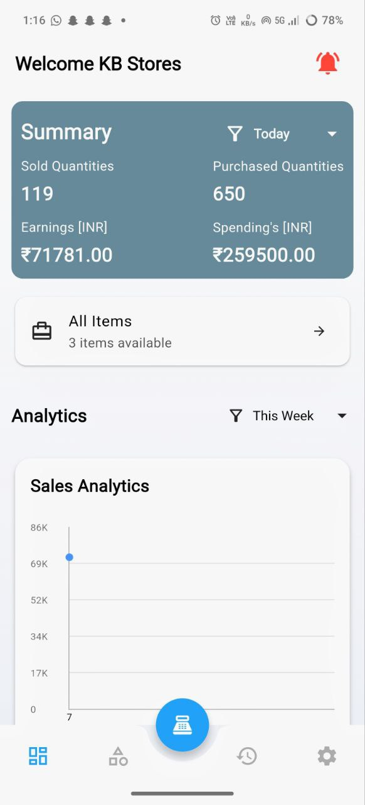
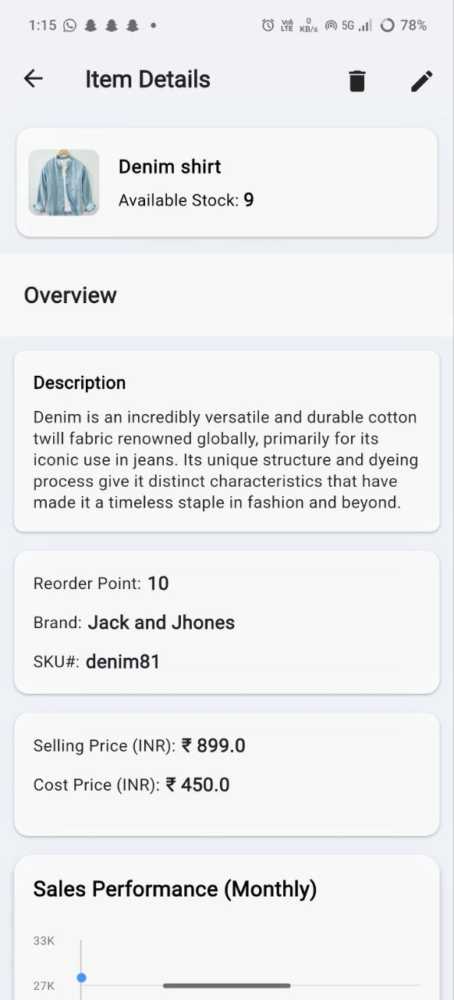
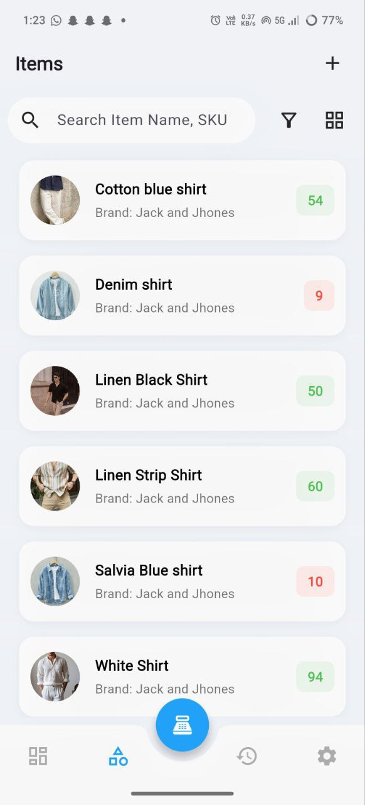
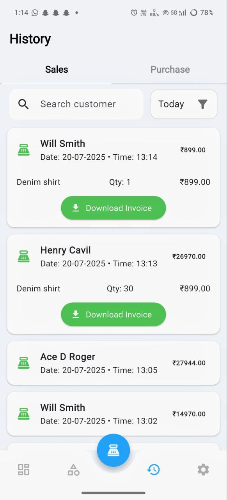
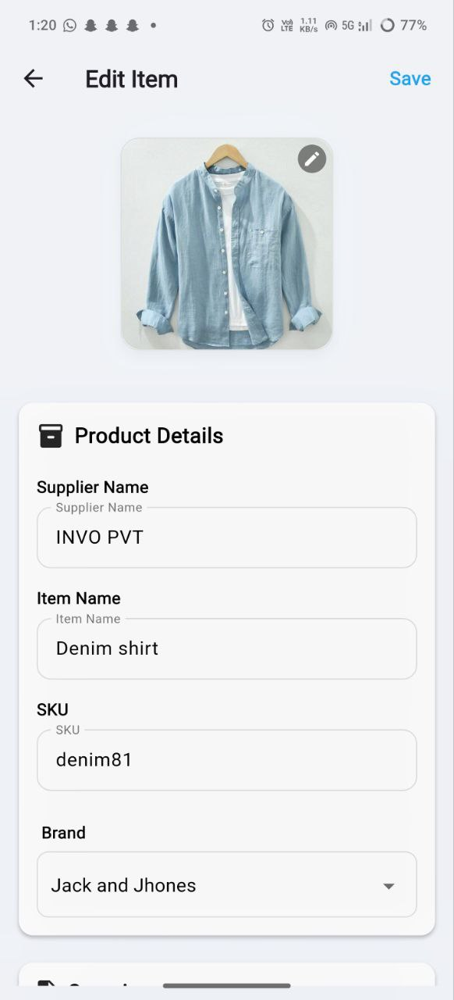
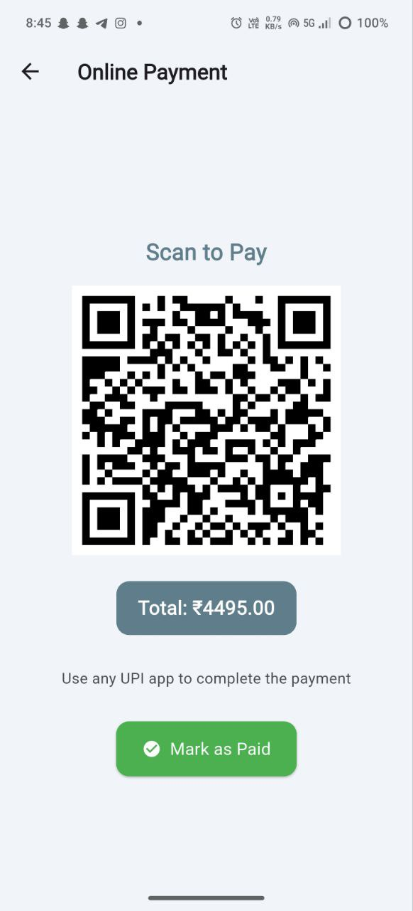

# 📦 Warehouse Management System

A robust, offline-first **Warehouse Management App** built with **Flutter**, powered by **Hive** for local storage and **Provider** for state management. Designed with a clean MVVM architecture, this app enables efficient inventory tracking, streamlined stock management, and insightful sales/purchase analytics.

---

## ✨ Key Features

- ✅ **Add / Edit / Delete Products** with detailed attributes
- 🧠 **Brand Management** with searchable modal bottom sheets
- 📦 **Stock Monitoring** with reorder point alerts
- 🧾 **Sales & Purchase Tracking** with detailed invoice view
- 🔍 **Real-Time Product Search & Filtering**
- 🖼️ **Product Image Upload Support**
- 📄 **PDF Invoice Generation** (download & share)
- 🧑‍💼 **Organization Profile & Settings Management**
- 🌐 **Offline-First Storage** using Hive (no internet required)
- 🌙 **Dark Mode Support**
- 🧊 **MVVM Architecture** for clean, scalable code
- 🧾 **Dashboard Summary** of total sales, purchases, and stock
- 📲 **QR Code-Based Selling**
    - Instantly sell products using a scanned QR code linked to the shop owner’s identity or product SKU
    - Speeds up POS (Point of Sale) flow and minimizes manual entry

---

## 🧱 Tech Stack

| Technology          | Purpose                                 |
|---------------------|------------------------------------------|
| **Flutter**         | Cross-platform mobile/web UI             |
| **Hive**            | Local NoSQL database (offline-first)     |
| **Provider**        | State management                         |
| **Firebase Hosting**| Web deployment                           |
| **MVVM Architecture**| Separation of concerns & scalability    |
| **QR Scanner**      | Scan-and-sell feature for fast checkout  |

---

## 📂 Project Structure

```
lib/
├── constants/         # Colors, text styles, route names
├── hive_config/       # Hive box setup and adapters
├── models/            # Hive models (Product, Brand, Sale, Purchase, etc.)
├── theme/             # App-wide providers
├── utils/             # Helper functions and utilities
├── view/              # UI screens (AddItem, ItemDetails, Summary, etc.)
├── viewmodel/         # Business logic (controllers, data handlers)
└── main.dart          # Entry point
```

---

## 🛠️ Setup Instructions

1. **Clone the Repository**
   ```bash
   git clone https://github.com/your-username/warehouse-management.git
   cd warehouse-management
   ```

2. **Install Dependencies**
   ```bash
   flutter pub get
   ```

3. **Run on Device or Web**
   ```bash
   flutter run       # For mobile
   flutter build web # For Firebase Hosting
   ```

4. **Deploy to Firebase**
   ```bash
   firebase deploy
   ```

---

## 🌐 Live Demo

> [🔗 View Web Version (Firebase Hosting)](https://warehousemanagement-20658.web.app)

---

## 📱 APK for Android

> 📥 [Download via Amazon Appstore](https://www.amazon.com/dp/B0FJ75D6XK) 

---
## 📸 Screenshots

### 📊 Summary Dashboard
> 

### 🧾 Item Details Screen
> 

### 📦 All Items Screen
> 

### 📈 Selling History Screen
> 

### ✏️ Edit Item Screen
> 

### 📲 QR-Based Selling Screen
> 

---

## 👨‍💻 Developed By

**Kiran K Babu**  
Flutter Developer | Focused on Building Clean, Scalable, and High-Performance Mobile Applications
📍 Kerala, India  
🔗 [LinkedIn](https://www.linkedin.com/in/yourprofile) | 🌐 [Portfolio](https://your-portfolio.com)

---

## ⚖️ License

This project is licensed under the **MIT License**.  
See the [LICENSE](LICENSE) file for more information.

---

> 📌 _“Great things never come from comfort zones.”_  
> — Kiran K Babu
